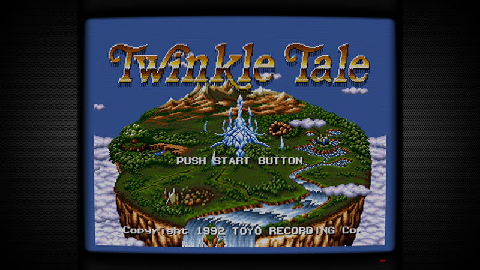
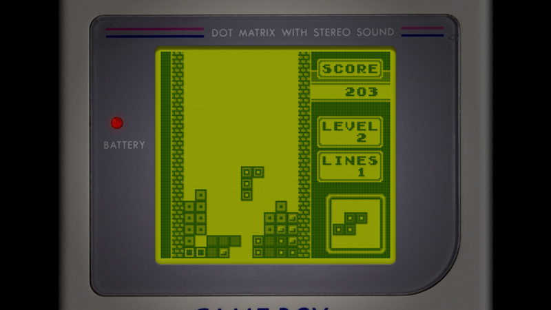
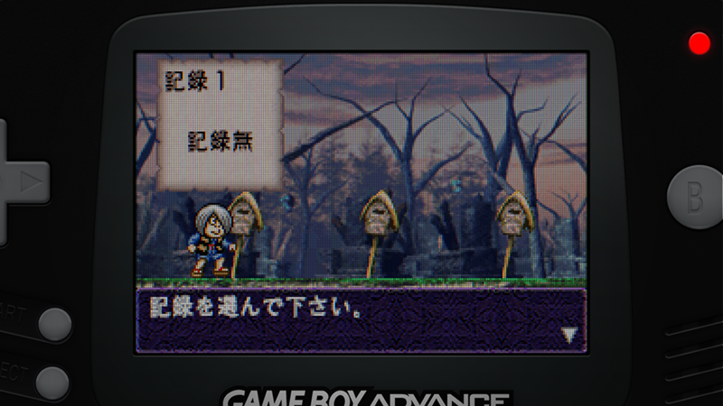
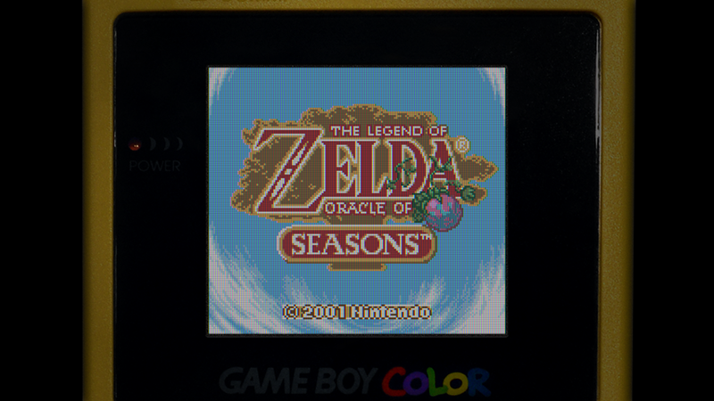
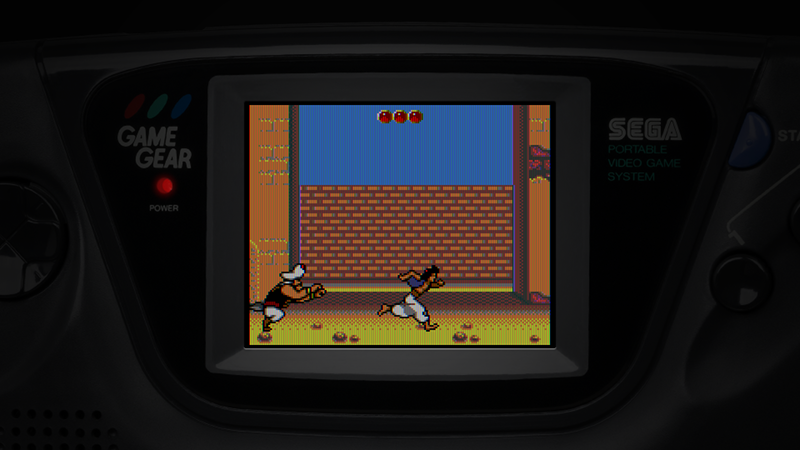
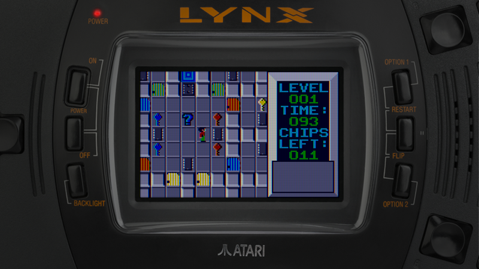

Retroarch Overlays
==================

Here you can find the overlays for retroarch I've been creating. I wanted them
to be as photorealistic as possible so most of them are based on actual pictures
(with some modifications). The one I'm not happy with is the Game Boy Advance
one which is a very stylised vector graphic but I haven't been lucky so far
finding a good front/undistorted picture for that system.

I also use shaders to imitate the look and "feel" of old screens when using
emulators, you'll see them in the screenshots below. In the future I'll also
include their configuration in this repository.

Aspect ratios
=============

Retroarch provides some automatic aspect ratio presets, through option
`aspect_ratio_index` in retroarch.cfg that set the size and position of the
emulated screen. Apart from the 4:3 overlay, you'll see the other ones use a
custom configuration:

    0 => 4:3
    ...
    21 => core provided
    23 => custom

This index have changed during time (e.g. custom used to be 22 and now --2020--
it's 23). So, if you see the emulated screen is not positioned/sized correctly,
I recommend you to go to official retroarch documentation and check the updated
list of values and their meanings.

LED colors
==========

My plan is to create every overlay with 5-6 different LED colours but at the
moment not all of them include this option.

Video configuration
===================

4:3
---

    aspect_ratio_index = "0"
    input_overlay_enable = "true"
    input_overlay_opacity = "1.000000"
    input_overlay = "YOUR_PATH/4_3/4_3_red.cfg"

Game Boy
--------

    # Zoom x5
    #--------
    aspect_ratio_index = "23"
    # video_scale_integer = "false"  <- Not sure why I commented it.
    custom_viewport_height = "720"
    custom_viewport_width = "800"
    input_overlay = "YOUR_PATH/gbo/gbo_red.cfg"

Game Boy Advance
----------------

    # Zoom x5
    #--------
    aspect_ratio_index = "23"
    custom_viewport_height = "800"
    custom_viewport_width = "1200"
    input_overlay = "YOUR_PATH/gba-crt/gba-crt_red.cfg"

Game Boy Color
--------------

    # Zoom x5
    #--------
    aspect_ratio_index = "23"
    # video_scale_integer = "false"  <- Not sure why I commented it.
    custom_viewport_height = "720"
    custom_viewport_width = "800"
    input_overlay = "YOUR_PATH/gbc/gbc.cfg"

Lynx
----

    # Zoom x5
    #--------
    aspect_ratio_index = "23"
    # video_scale_integer = "false"  <- Not sure why I commented it.
    custom_viewport_height = "510"
    custom_viewport_width = "800"
    input_overlay = "YOUR_PATH/lnx/lnx_red.cfg"

Screenshots
-----------

You can find the images at full resolution in `screenshots` dir.

Credits
-------

Console pictures: [Evan Amos](https://www.wikiwand.com/en/Evan_Amos)

